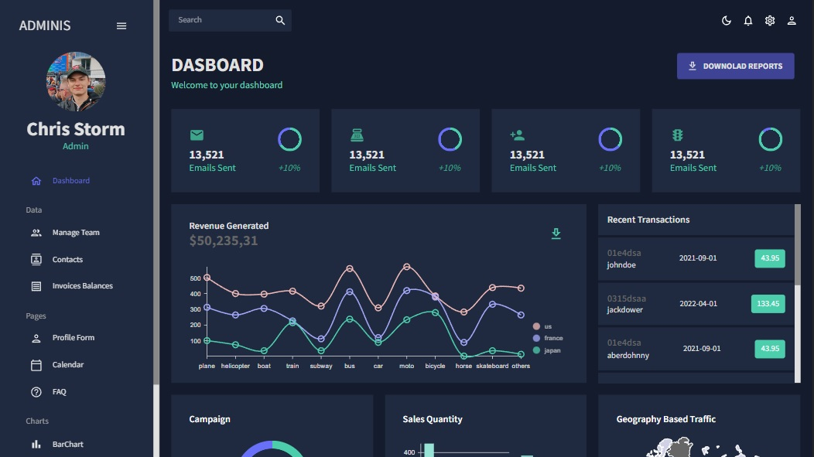
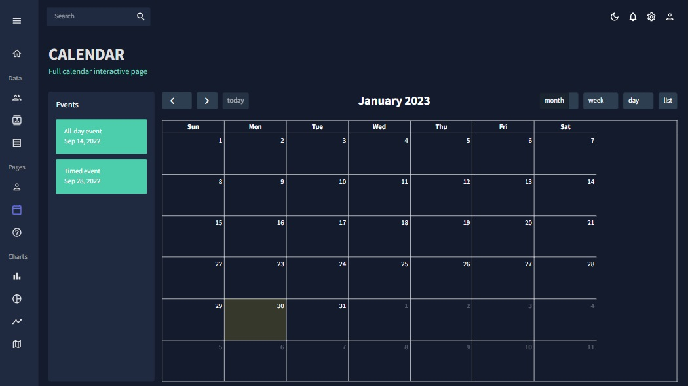
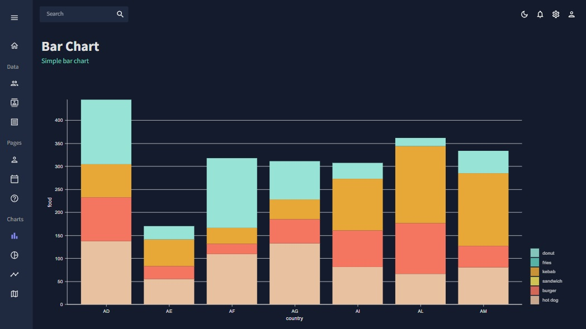

# Admin Dasboard

## Table of contents
* [General info](#general-info)
* [Technologies](#technologies)
* [Screenshots](#screenshots)
* [Installation](#installation)
* [Available scripts](#available-scripts)
* [Live demo](#live-demo)

## General info
Admin Dashboard is a project created in React. While writing it, I became more familiar with Material UI and tools such as Formik, Fullcalendar and Nivo. 

## Technologies
| Tech                                                    | Description                              |
| ------------------------------------------------------- | ---------------------------------------- |
| [React](https://reactjs.org/)                           | A JavaScript library for building user interfaces   |
| [ReactRouter](https://reactrouter.com/)                           | React Router is a standard library for routing in React   |
| [Material UI](https://mui.com/)                           | Open-source project that features React components that implement Google's Material Design   |
| [FullCalendar](https://fullcalendar.io/)                           | FullCalendar provides a highly performant React component that accepts JSX for rendering nested content   |
| [Formik](https://formik.org/)                           | Formik is the world's most popular open source form library for React and React Native   |
| [Nivo](https://nivo.rocks/)                           | Nivo provides a rich set of dataviz components, built on top of D3 and React   |
| [Sass](https://sass-lang.com/)                           | Professional grade CSS extension   |
| [Vite](https://vitejs.dev/)                           | build tool that aims to provide a faster and leaner development experience   |


## Screenshots
<p align="center">
    
</p>
<p align="center">
    
</p>

<p align="center">
    
</p>

## Installation

```bash
git clone https://github.com/MobbySchiller/admin-dashboard.git
npm install
npm run dev
```

## Available scripts
| Command                   | Description                   |
| ------------------------- | ----------------------------- |
| `npm run dev`           | Open local server             |
| `npm run build`           | Create optimized build        |
| `npm run preview`            | Run local server on build version                    |

## Live demo
[Click here](https://mobbyschiller.github.io/admin-dashboard/)
